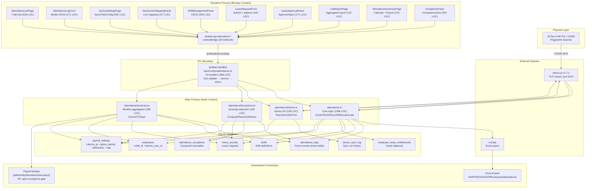

# EZOffice Attendance System — Current Architecture

> **Date:** 2026-07-10  
> **Status:** Complete technical analysis — read this before implementing any HR/Payroll module on top of the attendance system.  
> **Related documents:** `ARCHITECTURE.md`, `docs/DEVICE_SYNC_AUDIT.md`, `CLAUDE.md §7 Decision Log`

---

## Table of Contents

1. [Attendance Flow (End-to-End)](#1-attendance-flow-end-to-end)
2. [Device Integration](#2-device-integration)
3. [Attendance Storage (All Tables)](#3-attendance-storage-all-tables)
4. [Processing Logic](#4-processing-logic)
5. [Current Attendance Rules](#5-current-attendance-rules)
6. [Employee Relationship Mapping](#6-employee-relationship-mapping)
7. [Current UI Flow](#7-current-ui-flow)
8. [Services](#8-services)
9. [APIs](#9-apis)
10. [Architecture Diagram (Mermaid)](#10-architecture-diagram)
11. [Current Limitations](#11-current-limitations)
12. [Refactoring Risks](#12-refactoring-risks)

---

## 1. Attendance Flow (End-to-End)

### 1.1 Full System Flow

```
                   ┌─────────────────────────────────────────────────────────────┐
                   │                    TWO ENTRY PATHS                           │
                   └──────────────────────┬──────────────────────────────────────┘
                                          │
           ┌──────────────────────────────┼──────────────────────────────┐
           │                              │                              │
    【PATH A: ZKTeco Device】      【PATH B: Manual via UI】       【PATH C: Admin Backfill】
           │                              │                              │
    ┌──────▼──────┐              ┌────────▼────────┐            ┌───────▼────────┐
    │ Fingerprint │              │ Quick Clock      │            │ AttendanceLog  │
    │ Scanner     │              │ Panel (React UI) │            │ Form (Modal UI) │
    │ (Physical)  │              │ Admin picks      │            │ Admin manually  │
    └──────┬──────┘              │ employee →       │            │ keys in any     │
           │                     │ Clock In/Out     │            │ IN or OUT punch │
           │                     └────────┬────────┘            │ for any employee│
           │                              │                     └───────┬────────┘
           │                              │                             │
    ┌──────▼──────┐                       │                             │
    │ ZKTeco K40  │                       │                             │
    │ Pro / V1000 │                       │                             │
    │ (Hardware)  │                       │                             │
    └──────┬──────┘                       │                             │
           │                              │                             │
           │ TCP/IP Port 4370             │                             │
           │ (Ethernet LAN)               │                             │
           │                              │                             │
    ┌──────▼──────┐                       │                             │
    │ zkteco-js   │                       │                             │
    │ npm library │                       │                             │
    │ (v1.7.2)    │                       │                             │
    └──────┬──────┘                       │                             │
           │                              │                             │
           │ ADMIN MANUAL TRIGGER         │                             │
           │ ("Sync Now" button)          │                             │
           │                              │                             │
    ┌──────▼──────┐                       │                             │
    │ Device Sync │                       │                             │
    │ Pipeline    │                       │                             │
    │ (see §4.2)  │                       │                             │
    └──────┬──────┘                       │                             │
           │                              │                             │
           └──────────────┬───────────────┘                             │
                          │                                             │
                          ▼                                             │
                  ┌─────────────────────────────────────────────┐       │
                  │  IPC LAYER (electron/ipc/attendance.ts)     │       │
                  │                                              │       │
                  │  24 handlers: Zod validate → service → return│◄──────┘
                  └──────────────────┬──────────────────────────┘
                                     │
                                     ▼
                  ┌─────────────────────────────────────────────┐
                  │  SERVICE LAYER (4 files, see §8)             │
                  │                                              │
                  │  attendance.ts        (core logic, 1396 LOC) │
                  │  attendanceDevice.ts  (device I/O, 130 LOC)  │
                  │  attendanceExceptions.ts (anomaly detection) │
                  │  attendanceSummary.ts (monthly aggregation)  │
                  └──────────────────┬──────────────────────────┘
                                     │
                                     ▼
                  ┌─────────────────────────────────────────────┐
                  │  SQLite DATABASE (WAL mode)                  │
                  │  ./data/ezoffice.dev.db (dev)               │
                  │  %APPDATA%/EZOffice/data/ezoffice.db (prod)  │
                  └──────────────────┬──────────────────────────┘
                                     │
                                     ▼
                  ┌─────────────────────────────────────────────┐
                  │  PRELOAD (electron/preload.ts)               │
                  │  contextBridge → window.api.attendance.*     │
                  │  (28 typed methods, see §9)                  │
                  └──────────────────┬──────────────────────────┘
                                     │
                                     ▼
                  ┌─────────────────────────────────────────────┐
                  │  RENDERER (React 19 + @tanstack/react-query) │
                  │                                              │
                  │  AttendanceListPage (7-tab hub, 528 LOC)     │
                  │  ├── Logs       (Quick Clock + Table)        │
                  │  ├── Shifts     (ShiftManagementPanel)       │
                  │  ├── Leave      (Approval Panel + Request)   │
                  │  ├── Late Report(LateReportPage)             │
                  │  ├── Summary    (Monthly Calendar + Export)  │
                  │  ├── Exceptions (ExceptionsPanel)            │
                  │  └── Device     (Settings + User Mapping)    │
                  └──────────────────────────────────────────────┘
```

### 1.2 Step-by-Step Description

#### Path A: Device → Database

| Step | Where | What Happens |
|------|-------|-------------|
| 1 | Physical | Employee scans fingerprint on ZKTeco K40 Pro / V1000 device |
| 2 | Device | Device stores the punch internally (user_id, record_time, type, state) |
| 3 | UI | Admin clicks "Sync Now" button in Device Settings tab |
| 4 | IPC | `attendance:syncFromDevice` handler reads `device_ip`/`device_port` from `payroll_settings` |
| 5 | Service | `syncFromDeviceEthernet()` in `attendance.ts:508` — see §4.2 for full pipeline |
| 6 | DB | Raw punches inserted as `source='device'`, `device_id=<device_ip>` |
| 7 | React Query | `invalidateQueries` refetches, UI updates automatically |

**Key: This is NOT real-time. It is a manual pull — admin must click "Sync Now."**

#### Path B: Manual Quick Clock

| Step | Where | What Happens |
|------|-------|-------------|
| 1 | UI | Admin selects employee in Quick Clock dropdown |
| 2 | UI | System shows current IN/OUT status via `getLastForEmployee()` |
| 3 | UI | Admin clicks "Clock In" or "Clock Out" |
| 4 | IPC | `attendance:clockIn` or `attendance:clockOut` handler with Zod validation |
| 5 | Service | `clockIn()`/`clockOut()` in `attendance.ts:256` — checks alternation, snapshots shift, computes lateness |
| 6 | DB | Row inserted as `source='manual'`, `device_id=null` |

#### Path C: Admin Backfill/Edit

| Step | Where | What Happens |
|------|-------|-------------|
| 1 | UI | Admin clicks a log row or "Add Entry" → `AttendanceLogForm` modal |
| 2 | UI | Fills employee, type, datetime, note |
| 3 | IPC | `attendance:create` or `attendance:update` with Zod validation |
| 4 | Service | `createManualLog()` or `updateAttendanceLog()` with full alternation re-check |

---

## 2. Device Integration

### 2.1 Overall Architecture

```
ZKTeco K40 Pro / V1000  ←→  EZOffice Electron App
  (Physical hardware)          (Desktop software)

Communication: TCP/IP over Ethernet LAN
Port: 4370 (ZKTeco default, configurable)
Direction: PULL only (EZOffice polls the device)
Trigger: Manual ("Sync Now" button, no cron/webhook/websocket)
Library: zkteco-js v1.7.2 (npm)
```

### 2.2 How It Works — Pull Model

| Aspect | Detail |
|--------|--------|
| **Push or Pull?** | **Pull.** The app initiates all connections to the device. |
| **Real-time?** | **No.** No background service, no real-time listener, no webhook. |
| **Polling interval?** | **None.** Only triggered when admin clicks "Sync Now." |
| **Connection type** | TCP socket via `zkteco-js` library (`new Zkteco(ip, port, 5200, 5000)` — the last two params are timeout: 5.2s connect, 5s read) |
| **Protocol** | ZKTeco's proprietary UDP-like protocol over TCP |
| **Connection lifecycle** | `createSocket()` → `getAttendances()` / `getUsers()` / `getInfo()` / `getTime()` → `disconnect()` |

### 2.3 Library (`zkteco-js`)

- **npm package:** `zkteco-js@^1.7.2`
- **Usage locations** (3 files):
  - `electron/services/attendance.ts:524` — `getAttendances()` for sync
  - `electron/services/attendanceDevice.ts:21` — `getInfo()` + `getTime()` for test connection
  - `electron/services/attendanceDevice.ts:81` — `getUsers()` for device user mapping
  - `electron/services/attendanceDevice.ts:113` — `setTime()` for clock drift correction
- **Bundling:** Externalized in `vite.config.ts` (same as `better-sqlite3`, `pdfmake`, `exceljs`) — the library is loaded as a Node require at runtime, not bundled
- **Type safety:** Library has loose types; `any` is used but isolated within the three functions (per CLAUDE.md §3)

### 2.4 Device Configuration Storage

- Stored in `payroll_settings` singleton table (row `id = 1`):
  - `device_ip` (TEXT, nullable) — IP/hostname of the ZKTeco device
  - `device_port` (INTEGER, default 4370) — TCP port
  - `punch_debounce_minutes` (INTEGER, default 2) — bounce suppression window
  - `max_session_hours` (REAL, default 16) — session cap for overtime/exception detection
  - `device_last_synced_at` (TEXT, nullable) — watermark timestamp from last sync
  - `grace_period_minutes` (INTEGER, default 15) — late tolerance

### 2.5 Device Features Implemented

| Feature | Status | Service Function |
|---------|--------|-----------------|
| Pull attendance logs | Yes | `syncFromDeviceEthernet()` |
| Test Connection (info + clock check) | Yes | `testDeviceConnection()` |
| List enrolled users | Yes | `getDeviceUsers()` |
| Set device time (drift fix) | Yes | `setDeviceTime()` |
| Last sync log | Yes | `getLastSyncLog()` |
| Purge & re-sync | Yes | `purgeAttendanceLogs()` (device/manual/all scope, UI: Logs tab "Advanced: Bulk delete / reset logs") |
| Real-time listener | **No** | — |
| Enrollment from app | **No** (manual on device) | — |

---

## 3. Attendance Storage (All Tables)

### 3.1 Table Inventory — 8 tables involved

```
attendance_logs          (core punch events)
attendance_exceptions    (computed anomalies)
device_sync_log          (persisted sync results)
shifts                   (work shift definitions)
leave_records            (leave requests)
employee_leave_entitlements  (yearly leave balances)
employees                (with device_user_id, shift_id)
payroll_settings         (device config, grace period, session cap)
```

### 3.2 `attendance_logs` — The Core Event Table

> **One row per physical punch event.** NOT one row per day. An employee who clocks IN, goes for lunch, returns (IN again), and clocks OUT will have 4 rows.

| Column | Type | Constraints | Purpose |
|--------|------|-------------|---------|
| `id` | INTEGER | PK, AUTOINCREMENT | Unique row identifier |
| `employee_id` | INTEGER | NOT NULL, FK → employees(id) ON DELETE RESTRICT | Which employee |
| `type` | TEXT | NOT NULL, CHECK('in', 'out') | IN or OUT punch |
| `timestamp` | TEXT | NOT NULL (ISO 8601 naive local) | When the punch occurred |
| `source` | TEXT | NOT NULL, CHECK('manual', 'device'), DEFAULT 'manual' | How the row was created |
| `device_id` | TEXT | nullable | Device IP when source='device', null otherwise |
| `note` | TEXT | nullable | Admin note for backfill reasons |
| `shift_id` | INTEGER | nullable, FK → shifts(id) ON DELETE SET NULL | Snapshot of employee's shift at punch time |
| `status` | TEXT | NOT NULL, CHECK('on-time', 'late', 'absent', 'excused-late'), DEFAULT 'on-time' | Lateness classification |
| `created_at` | TEXT | NOT NULL, DEFAULT datetime('now') | Row creation timestamp |
| `updated_at` | TEXT | NOT NULL, DEFAULT datetime('now') | Last modification timestamp |

**Indexes:**
- `idx_attendance_logs_employee_timestamp` on `(employee_id, timestamp)` — time-range queries
- `idx_attendance_logs_unique` UNIQUE on `(employee_id, timestamp, type)` — prevents duplicate punches

**Key design decisions:**
- `ON DELETE RESTRICT` on `employee_id` — employees with attendance history cannot be deleted
- `source` and `device_id` are separate columns — `source='manual'` can have `device_id=null`, `source='device'` has `device_id=<IP>`
- `shift_id` is snapshot (not live lookup) — deleting a shift never destroys historical records

### 3.3 `attendance_exceptions` — Computed Anomalies

> Computed on-demand before payroll runs. Blocks payroll (D5 gate) while open exceptions exist.

| Column | Type | Constraints | Purpose |
|--------|------|-------------|---------|
| `id` | INTEGER | PK, AUTOINCREMENT | |
| `employee_id` | INTEGER | NOT NULL, FK → employees(id) ON DELETE CASCADE | |
| `year` | INTEGER | NOT NULL | Year of the exception |
| `month` | INTEGER | NOT NULL | Month (1-12) |
| `date` | TEXT | NOT NULL (YYYY-MM-DD) | Day the exception applies to |
| `exception_type` | TEXT | NOT NULL, CHECK('missing_punch', 'over_long_session', 'punch_on_leave') | Type of anomaly |
| `description` | TEXT | NOT NULL | Human-readable summary |
| `status` | TEXT | NOT NULL, CHECK('open', 'resolved', 'dismissed'), DEFAULT 'open' | Resolution state |
| `note` | TEXT | nullable | Admin note when dismissing/resolving |
| `related_log_ids` | TEXT | nullable (JSON array) | attendance_log ids involved |
| `created_at` / `updated_at` | TEXT | timestamps | |

**Indexes:**
- `idx_attendance_exceptions_employee_month` on `(employee_id, year, month)`
- `idx_attendance_exceptions_status_month` on `(status, year, month)`

### 3.4 `device_sync_log` — Sync Persistence

> Rolling log of sync runs. Renderer reads the last row to show sync results.

| Column | Type | Purpose |
|--------|------|---------|
| `id` | INTEGER | PK |
| `device_ip` | TEXT | Which device was synced |
| `started_at` | TEXT | ISO timestamp when sync began |
| `inserted` | INTEGER | New rows inserted |
| `skipped` | INTEGER | Rows deduplicated/ignored |
| `errors_json` | TEXT (nullable) | JSON array of error strings |
| `created_at` | TEXT | Row creation timestamp |

### 3.5 `shifts` — Work Shift Definitions

> Reusable shift profiles. Referenced by employees (default shift) and attendance_logs (punch-time snapshot).

| Column | Type | Constraints | Purpose |
|--------|------|-------------|---------|
| `id` | INTEGER | PK | |
| `name` | TEXT | NOT NULL, UNIQUE | Display name (e.g. "Morning") |
| `start_time` | TEXT | NOT NULL ("HH:MM" 24h) | Shift start time |
| `end_time` | TEXT | NOT NULL ("HH:MM" 24h) | Shift end time |
| `standard_hours` | REAL | NOT NULL, CHECK(> 0) | Expected work hours (governs OT) |
| `created_at` / `updated_at` | TEXT | timestamps | |

**Default seed data:** Morning (08:00–17:00, 8h), Afternoon (13:00–22:00, 8h), Night (22:00–06:00, 8h)

**Night shift support:** Handled in service-layer logic. Columns are plain "HH:MM" strings. `computeMinutesLate()` treats night shifts (start > end, e.g. 22:00→06:00) correctly.

### 3.6 `leave_records` — Leave Requests

| Column | Type | Constraints | Purpose |
|--------|------|-------------|---------|
| `id` | INTEGER | PK | |
| `employee_id` | INTEGER | NOT NULL, FK → employees(id) ON DELETE RESTRICT | |
| `leave_type` | TEXT | NOT NULL, CHECK('annual', 'sick', 'unpaid') | |
| `date_from` | TEXT | NOT NULL (YYYY-MM-DD, inclusive) | |
| `date_to` | TEXT | NOT NULL (YYYY-MM-DD, inclusive) | |
| `reason` | TEXT | nullable | |
| `status` | TEXT | NOT NULL, CHECK('pending', 'approved', 'rejected'), DEFAULT 'pending' | |
| `created_at` / `updated_at` | TEXT | timestamps | |
| | | CHECK(date_to >= date_from) | Table-level constraint |

**Indexes:** `(employee_id, date_from, date_to)` and `(status)`

### 3.7 `employee_leave_entitlements` — Yearly Balances

| Column | Type | Constraints | Purpose |
|--------|------|-------------|---------|
| `id` | INTEGER | PK | |
| `employee_id` | INTEGER | NOT NULL, FK → employees(id) ON DELETE CASCADE | |
| `leave_type` | TEXT | NOT NULL, CHECK('annual', 'sick', 'unpaid') | |
| `balance` | REAL | NOT NULL, DEFAULT 0, CHECK(>= 0) | Remaining days |
| `year` | INTEGER | NOT NULL, CHECK(2000–2100) | Calendar year |
| | | UNIQUE(employee_id, leave_type, year) | One balance row per type per year |

**How balances get set (2026-07-15):** originally there was no way to populate this table at all except a manual SQL insert. `payroll_settings.default_annual_leave_days`/`default_sick_leave_days` (added in `0016_leave_entitlement_defaults.sql`) hold the company-wide default; `initializeYearlyLeaveEntitlements(db, year)` bulk-applies them to every active employee for a year (skipping any row that already exists), and `upsertLeaveEntitlement(db, input)` sets/adjusts a single employee's balance directly. UI: Attendance → Leave Entitlements tab.

### 3.8 Employee Columns (Attendance-Related)

The `employees` table gained two attendance columns:

| Column | Type | FK | Purpose |
|--------|------|----|---------|
| `shift_id` | INTEGER (nullable) | FK → shifts(id) ON DELETE SET NULL | Employee's default shift |
| `device_user_id` | INTEGER (nullable) | *(no FK — not a table, a device-internal ID)* | Maps to device's internal user ID |

---

## 4. Processing Logic

### 4.1 Are Raw Logs Preserved?

**Yes.** `attendance_logs` stores raw punch events. No transformation at storage time:
- Device punches are inserted exactly as the device reports them (after timestamp parsing)
- The original device timestamp is preserved in the `timestamp` column
- `source='device'` tags distinguish device punches from manual ones
- The original device user_id is discarded after mapping to `employee_id` (only the employee_id is stored)

### 4.2 Device Sync Pipeline (Complete Flow)

When `syncFromDeviceEthernet()` runs (`attendance.ts:508`):

```
Step A: Pull & Parse
├── Open TCP socket to device via zkteco-js
├── Call getAttendances() → returns { data: [...] }
├── Parse each record: extract user_id, record_time
├── Validate timestamp (reject unparseable → logged as error)
├── Watermark filter: skip logs at/before device_last_synced_at (H1 optimisation)
│   └── (DB unique constraint is still the correctness mechanism)
└── D2: device `state` field intentionally discarded (staff don't use state keys)

Step B: Device User ID → Employee Mapping
├── Look up each device_user_id in employees table (device_user_id column)
├── Unmapped users: collect into Set, log one error per user → all their punches skipped
└── Mapped punches proceed

Step C: Debounce (anti-bounce filter)
├── Per employee: sort punches by timestamp
├── Drop punches within punch_debounce_minutes (default 2 min) of the previous one
│   └── Keeps the FIRST punch in a bounce cluster
└── Count debounced-as-skipped

Step D: Per-Day IN/OUT Assignment
├── Group remaining punches by (employee_id, calendar_date)
├── Within each group: sort by timestamp
├── Assign by position: 1st punch of the day = IN, 2nd = OUT, 3rd = IN, ...
│   └── This is deterministic across sync runs (same punch always same type)
└── Sort all typed punches globally by timestamp for insert order

Step E: Dedup (Duplicate Detection)
├── For each typed punch: check DB for any log within ±60 seconds of same employee
│   └── Type-independent: a punch at a moment in time is unique regardless of IN/OUT label
├── If duplicate exists → count as skipped
└── Uniques proceed to insert

Step F: Insert with Metadata
├── Snapshot employee's current shift_id
├── Compute lateness status (only if NOT historical — M2 fix: >1 day before today)
├── Insert row with source='device', device_id=<device_ip>
└── Track newest inserted timestamp for watermark advance

Step G: Persist & Watermark
├── Advance device_last_synced_at (only if NO unmapped users — preserves ability to re-fetch)
├── Insert device_sync_log row (inserted, skipped, errors)
└── Return DeviceSyncResult to renderer
```

### 4.3 Are Duplicate Scans Filtered?

**Yes, at two levels:**

1. **Debounce (in-memory):** Punches from the same employee within `punch_debounce_minutes` (default 2 min) of each other collapse to the first one. Absorbs device bounce/double-tap.

2. **DB-level dedup:** A UNIQUE index on `(employee_id, timestamp, type)` makes duplicate inserts throw a constraint violation. The ±60s window check before insert catches near-duplicates where timestamps differ by seconds (e.g. manual vs. device double-capture).

### 4.4 Are IN/OUT Determined?

**Yes, but behavior differs by source:**

- **Manual (UI clock-in/clock-out):** The admin explicitly chooses IN or OUT. The system validates alternation (`assertAlternation()` — rejects double-IN or double-OUT).

- **Device sync:** The device data has a `type` field but K40 Pro doesn't reliably set it. EZOffice **ignores** the device's type and instead **re-derives it per calendar day** by position: odd-indexed punches in a day = IN, even-indexed = OUT. This is the D2 locked decision from `DEVICE_SYNC_AUDIT.md`.

### 4.5 Is Attendance Calculated Immediately?

**Partially.** On clock-in:
- `shift_id` is snapshotted (who was assigned which shift at punch time)
- `status` is computed (`on-time` / `late` against shift start + grace period)
- But **hours, OT, daily totals, and monthly aggregation are NOT computed immediately**

They are computed on-demand:
- `getMonthlyCalendar()` — per-day view with hours, first IN, last OUT, status
- `aggregateDailyHours()` — pure function; used by `getMonthlyAttendanceSummary()` for payroll
- `computeAttendanceExceptions()` — anomaly detection, run manually before payroll

### 4.6 Processing Engine?

**There is no real-time or scheduled processing engine.** All computation is:

| What | When | How |
|------|------|-----|
| Clock-in status (late/on-time) | At clock-in time | `computeClockInStatus()` called inside `clockIn()` |
| Monthly hours/OT | On-demand (UI tab or payroll calc) | `getMonthlyAttendanceSummary()` / `aggregateDailyHours()` |
| Monthly calendar | On-demand (Summary tab) | `getMonthlyCalendar()` |
| Late report | On-demand (Late Report tab) | `getLateReport()` |
| Exception detection | Manual trigger ("Compute Exceptions" button) | `computeAttendanceExceptions()` |
| Excel export | Manual trigger ("Export" button) | `exportMonthlyAttendanceExcel()` |

---

## 5. Current Attendance Rules

| Feature | Status | Where | Details |
|---------|--------|-------|---------|
| **Shift** | ✅ Yes | `shifts` table, `attendance.ts:99-164` | 3 default shifts (Morning/Afternoon/Night). Employee assigned via `shift_id`. Snapshot on clock-in. |
| **Late Detection** | ✅ Yes | `attendance.ts:153-164` | `computeClockInStatus()` compares punch time to shift start + grace period. Only on IN punches. |
| **Early Out** | ❌ No | — | No check exists for whether OUT is before shift end time. |
| **Overtime** | ✅ Yes (hours-based) | `attendanceSummary.ts:42-105` | D1 rule: hours beyond `standard_hours` (from shift or salary_structure) per calendar day = OT. |
| **Grace Period** | ✅ Yes | `payroll_settings.grace_period_minutes`, `attendance.ts:113-118` | Default 15 min. Configurable per organization. |
| **Break** | ❌ No | — | No break tracking. Multiple IN/OUT pairs per day are supported but not labeled as "lunch break." |
| **Multiple Scan** | ✅ Yes | Supported natively (event table) | Multiple IN/OUT pairs per day (lunch breaks). Each pair is a separate session. |
| **Missing Checkout** | ✅ Yes (as exception) | `attendanceExceptions.ts:171-179` | Odd-numbered punches on a day → `missing_punch` exception. Flagged, not auto-corrected. |
| **Auto Checkout** | ❌ No | — | No automatic OUT punch inserted at shift end. Missing checkouts must be handled manually. |
| **Holiday Engine** | ❌ No | — | No public holiday calendar exists. |
| **Leave Engine** | ✅ Yes | `leave_records` + `employee_leave_entitlements`, `attendance.ts:894-1065` | Annual/sick/unpaid. Balance check on request. Decrement on approval. Leave days excluded from payroll hours. |
| **Leave Overlap Detection** | ✅ Yes | `attendance.ts:904-913` | Rejects if date range overlaps existing pending/approved leave. |
| **Absent Classification** | ✅ Yes | `attendance.ts:1267-1277` | Days with no IN punch and no approved leave = `absent`. Set in `getMonthlyCalendar()`. |
| **Excused Late** | ✅ Yes | `attendance.ts:1074-1091` | Admin can change `late` → `excused-late` via "Excuse" button. Only on `late` rows. |
| **Session Cap** | ✅ Yes | `payroll_settings.max_session_hours`, `attendanceSummary.ts:71` | IN→OUT pairs longer than cap (default 16h) excluded from pay. Flagged as exception. |
| **Device Sync Watermark** | ✅ Yes | `payroll_settings.device_last_synced_at`, `attendance.ts:555` | Skips already-synced logs in subsequent runs (optimisation). |
| **Device Debounce** | ✅ Yes | `payroll_settings.punch_debounce_minutes`, `attendance.ts:591-604` | Collapses rapid double-taps from device into single punch. |
| **Clock Drift Detection** | ✅ Yes | `attendanceDevice.ts:30-43` | Compares device clock to PC time. Warns if >60s drift. |

---

## 6. Employee Relationship Mapping

```
┌─────────────────────────────────────────────────────────────────┐
│                    HOW EMPLOYEES ARE LINKED                       │
└─────────────────────────────────────────────────────────────────┘

【PATH A: Device → Employee】(for fingerprint punches)

    ZKTeco Device Internal User ID (small integer, e.g. 1, 2, 3...)
               │
               │  Lookup: employees.device_user_id = <device user ID>
               ▼
         employees.id (EZOffice internal employee ID)

【PATH B: UI → Employee】(for manual clock-in)

    Admin selects employee from dropdown in Quick Clock panel
               │
               │  Direct: dropdown value = employees.id
               ▼
         employees.id (EZOffice internal employee ID)

【Data stored in attendance_logs】
    attendance_logs.employee_id = employees.id (FK, ON DELETE RESTRICT)
```

**Mapping configuration:**
- `employees.device_user_id` (INTEGER, nullable) — set by admin in:
  - Master Data → Employee form (manual numeric entry)
  - Attendance → Device Settings → Device User Mapping panel (dropdown-based, live fetch from device)

**Uniqueness:** Enforced at application layer (SQLite ALTER TABLE doesn't support ADD COLUMN with UNIQUE). The `DeviceUserMappingPanel` clears the previous mapping before assigning a new one.

**The device `user_id` is a device-internal integer** — NOT the same as EZOffice's `employees.id`. If the admin doesn't configure `device_user_id` for an employee, that employee's device punches are skipped (logged as errors in `device_sync_log`).

---

## 7. Current UI Flow

### 7.1 Navigation

```
Sidebar
├── Dashboard (home, not attendance-specific)
├── Payroll
├── Attendance → /attendance → AttendanceListPage (7-tab hub)
└── Master Data
    ├── Employees
    ├── Customers
    ├── Suppliers
    └── Products
```

### 7.2 AttendanceListPage — 7-Tab Hub

The hub uses **local React state** for tab switching (no nested routes). All 7 panels render within the same page; only the active tab's content is visible.

#### Tab 1: Logs (Default)

```
┌──────────────────────────────────────────────────────────────┐
│  ┌─────────────────── Quick Clock Panel ──────────────────┐  │
│  │  [Employee dropdown ▼]  [Clock In] [Clock Out]          │  │
│  │  Status: "Currently clocked IN since 08:05"             │  │
│  └──────────────────────────────────────────────────────────┘  │
│                                                                │
│  ┌─────────────────── Filters ──────────────────────────────┐  │
│  │  Date From: [2026-07-01]  Date To: [2026-07-10]          │  │
│  └──────────────────────────────────────────────────────────┘  │
│                                                                │
│  ┌─────────────────── Table ────────────────────────────────┐  │
│  │ Employee │ Type │ Timestamp │ Shift │ Status │ Source │…│  │
│  │──────────┼──────┼───────────┼───────┼────────┼────────┼─│  │
│  │ Ali      │ IN   │ 08:05:00  │Morning│ Late   │Manual  │…│  │
│  │ Ali      │ OUT  │ 12:00:00  │Morning│On-Time │Manual  │…│  │
│  │ ...                                                        │  │
│  └────────────────────────────────────────────────────────────┘  │
│                                                                │
│  Click row → AttendanceLogForm modal (edit/delete)             │
│  "Excuse" button on rows where type='in' AND status='late'     │
└──────────────────────────────────────────────────────────────┘
```

**Data source:** `window.api.attendance.list(filters)` → `attendance_logs` table (JOIN employees, JOIN shifts)

#### Tab 2: Shifts

```
┌──────────────────────────────────────────────────────────────┐
│  Shift Management Panel                                       │
│  ┌──────────────────────────────────────────────────────────┐│
│  │ Name        │ Start  │ End   │ Hours │                    ││
│  │─────────────┼────────┼───────┼───────│  [Edit] [Delete]   ││
│  │ Morning     │ 08:00  │ 17:00 │ 8.0   │                    ││
│  │ Afternoon   │ 13:00  │ 22:00 │ 8.0   │                    ││
│  │ Night       │ 22:00  │ 06:00 │ 8.0   │                    ││
│  └──────────────────────────────────────────────────────────┘│
│  [+ Add Shift] button → modal form                            │
└──────────────────────────────────────────────────────────────┘
```

**Data source:** `window.api.attendance.listShifts()` → `shifts` table

#### Tab 3: Leave

```
┌──────────────────────────────────────────────────────────────┐
│  Two sub-panels:                                              │
│                                                                │
│  ┌─ Leave Requests Table ───────────────────────────────────┐ │
│  │ Employee │ Type  │ From      │ To        │ Status │ Acts │ │
│  │──────────┼───────┼───────────┼───────────┼────────┼──────│ │
│  │ Ali      │Annual │ 2026-07-15│ 2026-07-16│Pending │App/Rej│
│  └──────────────────────────────────────────────────────────┘ │
│                                                                │
│  ┌─ New Leave Request Button ───────────────────────────────┐ │
│  │ [+ Request Leave] → LeaveRequestForm modal                │ │
│  │   Employee select + type + dates + reason                 │ │
│  │   Shows LIVE leave balance for selected employee          │ │
│  └──────────────────────────────────────────────────────────┘ │
└──────────────────────────────────────────────────────────────┘
```

**Data source:** `window.api.attendance.listLeave()` → `leave_records` (JOIN employees)  
**Balance:** `window.api.attendance.getLeaveBalance(employeeId, year)` → `employee_leave_entitlements`

#### Tab 4: Late Report

```
┌──────────────────────────────────────────────────────────────┐
│  Month/Year filter [2026 ▼] [07 ▼]                            │
│                                                                │
│  ┌──────────────────────────────────────────────────────────┐│
│  │ Employee │ Late Count │ Excused │ Total Min │ Avg Min    ││
│  │──────────┼────────────┼─────────┼───────────┼───────────││
│  │ Ali      │ 3          │ 1       │ 45        │ 15.0      ││
│  │ Siti     │ 1          │ 0       │ 12        │ 12.0      ││
│  └──────────────────────────────────────────────────────────┘│
└──────────────────────────────────────────────────────────────┘
```

**Data source:** `window.api.attendance.getLateReport(year, month)` → aggregates `attendance_logs` (JOIN shifts for start_time)

#### Tab 5: Monthly Summary

```
┌──────────────────────────────────────────────────────────────┐
│  ┌─ Filters ───────────────────────────────────────────────┐  │
│  │ Employee: [Ali ▼]  Month: [2026 ▼] [07 ▼]  [Export ▾]   │  │
│  └──────────────────────────────────────────────────────────┘  │
│                                                                │
│  ┌─ Stat Tiles ─────────────────────────────────────────────┐ │
│  │ ┌──────────┐ ┌──────────┐ ┌──────────┐ ┌──────────┐     │ │
│  │ │ 160h     │ │ 20 days  │ │ 3 late   │ │ 0 leave  │     │ │
│  │ │Total Hrs │ │ Worked   │ │ Days     │ │ Days     │     │ │
│  │ └──────────┘ └──────────┘ └──────────┘ └──────────┘     │ │
│  └──────────────────────────────────────────────────────────┘  │
│                                                                │
│  ┌─ Calendar Table ─────────────────────────────────────────┐ │
│  │ Date       │ First IN │ Last OUT │ Hours │ Status        │ │
│  │────────────┼──────────┼──────────┼───────┼──────────────│ │
│  │ 2026-07-01 │ 08:05    │ 17:02    │ 8.95  │ Late          │ │
│  │ 2026-07-02 │ 07:58    │ 17:00    │ 9.03  │ On-time       │ │
│  │ 2026-07-04 │ —        │ —        │ 0     │ Leave (annual)│ │
│  │ 2026-07-06 │ —        │ —        │ 0     │ Absent        │ │
│  └──────────────────────────────────────────────────────────┘  │
└──────────────────────────────────────────────────────────────┘
```

**Data source:** `window.api.attendance.getMonthlyCalendar(employeeId, year, month)` → `attendance_logs` + `leave_records`  
**Export:** `window.api.attendance.exportMonthly(year, month)` → Excel file written to `%APPDATA%/EZOffice/exports/attendance/`

#### Tab 6: Exceptions

```
┌──────────────────────────────────────────────────────────────┐
│  Month/Year filter. [Compute Exceptions] button.               │
│                                                                │
│  ┌──────────────────────────────────────────────────────────┐│
│  │ Employee│ Date │ Type            │ Description      │ St ││
│  │─────────┼──────┼─────────────────┼─────────────────┼────││
│  │ Ali     │07-03 │ missing_punch   │ Odd # of punches │Open││
│  │ Siti    │07-05 │ over_long_session│ 18.5h exceeds 16│Open││
│  │ Abu     │07-02 │ punch_on_leave  │ Punched on leave │Open││
│  └──────────────────────────────────────────────────────────┘│
│                                                                │
│  Per row: [Resolve] button (one click).                        │
│            [Dismiss] button → modal requiring a note.          │
└──────────────────────────────────────────────────────────────┘
```

**Data source:** `window.api.attendance.listExceptions()` / `computeExceptions()` → `attendance_exceptions` table

#### Tab 7: Device Settings

```
┌──────────────────────────────────────────────────────────────┐
│  Device Configuration:                                        │
│  ┌──────────────────────────────────────────────────────────┐│
│  │ Device IP:   [192.168.1.100]     Port: [4370]             ││
│  │ Debounce:    [2] min   Session Cap: [16] h                ││
│  │ [Save Settings]  [Test Connection]                        ││
│  └──────────────────────────────────────────────────────────┘│
│                                                                │
│  ┌─ Test Result (after Test Connection) ────────────────────┐ │
│  │ Device: K40 Pro | Serial: ABC123 | Users: 25 | Logs: 1500 │ │
│  │ ⚠ Clock drift: +120s ahead — [Set Device Time]           │ │
│  └──────────────────────────────────────────────────────────┘ │
│                                                                │
│  ┌─ Sync ───────────────────────────────────────────────────┐ │
│  │ [Sync Now]    Last sync: 2026-07-10 08:30                  │ │
│  │ Inserted: 150 | Skipped: 3 | Errors: 0                     │ │
│  └──────────────────────────────────────────────────────────┘ │
│                                                                │
│  ┌─ Device User Mapping ────────────────────────────────────┐ │
│  │ (Sub-panel: DeviceUserMappingPanel)                        │ │
│  │ Device User ID │ Device Name  │ → EZOffice Employee ▼     │ │
│  │───────────────┼──────────────┼────────────────────────────│ │
│  │ 1             │ Ali bin Abu   │ Ali bin Abu               │ │
│  │ 2             │ Siti          │ [Select employee ▼]       │ │
│  └──────────────────────────────────────────────────────────┘ │
└──────────────────────────────────────────────────────────────┘
```

**Data source:** `window.api.attendance.testDevice()` / `getDeviceUsers()` / `getLastSyncLog()` / payroll settings

---

## 8. Services

### 8.1 `electron/services/attendance.ts` (1396 LOC)

**Responsibility:** Core business logic for everything attendance.

| Category | Methods | Description |
|----------|---------|-------------|
| **Query** | `listAttendanceLogs()`, `getAttendanceLogById()`, `getLastLogForEmployee()` | Read logs with optional filters. All join employees + shifts. |
| **Clock** | `clockIn()`, `clockOut()` | Create manual punch. Validates alternation. Snapshots shift. Computes lateness. |
| **CRUD** | `createManualLog()`, `updateAttendanceLog()`, `deleteAttendanceLog()` | Admin backfill/edit/delete. Full alternation re-check on edit. |
| **Device Sync** | `syncFromDeviceEthernet()`, `countAttendanceLogsForPurge()`, `purgeAttendanceLogs()` | Full device sync pipeline (see §4.2). Purge for cleanup (device/manual/all scope, respects closed-period lock). |
| **Shifts** | `listShifts()`, `getShiftById()`, `createShift()`, `updateShift()`, `deleteShift()`, `assignShiftToEmployee()` | CRUD for shift definitions. Assign default shift to employee. |
| **Leave** | `getEmployeeLeaveBalance()`, `createLeaveRequest()`, `approveLeave()`, `rejectLeave()`, `listLeaveRecords()` | Leave lifecycle: request → approve (decrement balance) or reject. |
| **Late** | `excuseLateEntry()`, `getLateReport()` | Excuse individual late punches. Aggregate late report. |
| **Summary** | `getMonthlyCalendar()`, `exportMonthlyAttendanceExcel()` | Per-employee calendar view. Excel export (exceljs). |
| **Validation** | `validateClockAgainstShift()` | Public function: warn admin before committing late clock-in. |

**Internal helpers (not exported):**
- `nowLocalISO()` — naive local ISO 8601 (no timezone suffix, matches SQLite)
- `queryById()` — shared JOIN query for single log
- `assertAlternation()` — shared alternation validation for all write paths. Checks against the punch chronologically adjacent to the new entry's own timestamp (`getPrecedingLog()`/`getFollowingLog()`), not the globally most recent punch — see the 2026-07-15 CLAUDE.md decision log entry for why this distinction matters for backfill.
- `getEmployeeShift()`, `getGracePeriodMinutes()`, `computeMinutesLate()`, `computeClockInStatus()`, `minutesBetween()` — shift/late math
- `getDeviceSyncSettings()`, `parseDeviceTimestamp()`, `persistSyncLog()` — sync internals
- `getLeaveRecordById()`, `getLeaveEntitlement()`, `countDaysInclusive()` — leave helpers

**Dependencies:**
- `better-sqlite3` (via `db` parameter — pure function, testable)
- `zkteco-js` (runtime require inside `syncFromDeviceEthernet()`)
- `exceljs` (runtime require inside `exportMonthlyAttendanceExcel()`)
- Shared types: `entities.ts`, `inputs.ts`

### 8.2 `electron/services/attendanceDevice.ts` (130 LOC)

**Responsibility:** Device connection operations (separated from `attendance.ts` for clean boundaries).

| Method | Purpose |
|--------|---------|
| `testDeviceConnection(ip, port)` | Opens socket, calls `getInfo()` + `getTime()`. Returns device name, serial, user/log counts, clock drift. Never throws (returns `{ok: false}` on error). |
| `getDeviceUsers(ip, port)` | Calls `getUsers()` on device. Returns `DeviceUser[]` for mapping panel. Throws on error. |
| `setDeviceTime(ip, port)` | Calls `setTime(new Date())` to sync device clock. Returns `{ok, error?}`. |
| `getLastSyncLog(db)` | Reads most recent `device_sync_log` row. |

**Dependencies:** `zkteco-js` (runtime require), `better-sqlite3` (via `db` parameter)

### 8.3 `electron/services/attendanceExceptions.ts` (248 LOC)

**Responsibility:** Anomaly detection for payroll pre-flight gate (D5).

| Method | Purpose |
|--------|---------|
| `listAttendanceExceptions(db, filters)` | List exceptions with optional employee/status filters. Joins employee name. |
| `computeAttendanceExceptions(db, year, month)` | On-demand computation. Checks: missing_punch (odd count/day), over_long_session (> max_session_hours), punch_on_leave. Upserts new exceptions as `open`. Preserves existing resolved/dismissed ones. |
| `resolveAttendanceException(db, id, note?)` | Marks `open` → `resolved`. Cannot resolve a dismissed exception. |
| `dismissAttendanceException(db, id, note)` | Marks `open` → `dismissed`. Note required. Only `open` exceptions can be dismissed. |

**Dependencies:** `better-sqlite3` (via `db` parameter)

### 8.4 `electron/services/attendanceSummary.ts` (258 LOC)

**Responsibility:** Monthly hours aggregation for payroll.

| Method | Purpose |
|--------|---------|
| `aggregateDailyHours(logs, monthStart, monthEnd, standardHours, leaveDates, maxSessionHours)` | **Pure function** (no DB — unit-testable). Pairs IN→OUT per employee, groups by calendar day, splits into regular/OT. Excludes leave days and over-cap sessions. D1 rule: OT = hours beyond standard per day. |
| `getMonthlyAttendanceSummary(db, filters)` | DB-bound function. Fetches logs with ±1 day margin (M1 fix for cross-midnight). Resolves standard_hours from shift or salary_structure. Calls `aggregateDailyHours()`. Returns one `EmployeeMonthlySummary` per employee. |

**Dependencies:** `better-sqlite3` (via `db` parameter), accesses `shifts`, `salary_structures`, `leave_records`, `attendance_logs`, `payroll_settings`

---

## 9. APIs

### 9.1 IPC Channels — All 30 Endpoints

Every endpoint is registered via `ipcMain.handle()` in `electron/ipc/attendance.ts`. Pattern: `channel:action`.

#### Core Attendance CRUD (8 endpoints)

| Channel | Handler Pattern | Purpose |
|---------|----------------|---------|
| `attendance:list` | `(filters?) → AttendanceLog[]` | List with optional employeeId / date range filters |
| `attendance:get` | `(id) → AttendanceLog` | Single log by ID |
| `attendance:getLastForEmployee` | `(employeeId) → AttendanceLog` | Most recent punch for quick clock status |
| `attendance:clockIn` | `({employee_id, timestamp?}) → AttendanceLog` | Manual clock-in via Quick Clock panel |
| `attendance:clockOut` | `({employee_id, timestamp?}) → AttendanceLog` | Manual clock-out via Quick Clock panel |
| `attendance:create` | `(CreateAttendanceLogInput) → AttendanceLog` | Admin backfill — create any punch |
| `attendance:update` | `(id, UpdateAttendanceLogInput) → AttendanceLog` | Edit existing punch |
| `attendance:delete` | `(id) → void` | Delete a punch |

#### Device Sync (8 endpoints)

| Channel | Handler Pattern | Purpose |
|---------|----------------|---------|
| `attendance:syncFromDevice` | `() → DeviceSyncResult` | Full sync pipeline (reads device IP from settings) |
| `attendance:countLogsForPurge` | `({dateFrom, dateTo, source}) → {count}` | Preview how many logs a bulk purge would delete |
| `attendance:purgeLogs` | `({dateFrom, dateTo, source}) → {deleted}` | Permanently delete logs in range, scoped to `'manual'`/`'device'`/`'all'`; resets sync watermark unless `source === 'manual'`; blocked if the range overlaps a closed payroll period |
| `attendance:testDevice` | `() → DeviceTestResult` | Real connection test with clock drift check |
| `attendance:getDeviceUsers` | `() → DeviceUser[]` | Live list of enrolled users on device |
| `attendance:setDeviceTime` | `() → {ok, error?}` | Sync device clock to PC time |
| `attendance:getLastSyncLog` | `() → DeviceSyncLog` | Most recent sync log entry |

#### Attendance Exceptions (4 endpoints)

| Channel | Handler Pattern | Purpose |
|---------|----------------|---------|
| `attendance:computeExceptions` | `({year, month}) → {created}` | Run anomaly detection for the month |
| `attendance:listExceptions` | `({year, month, employeeId?, status?}) → AttendanceException[]` | List exceptions with filters |
| `attendance:resolveException` | `({id, note?}) → AttendanceException` | Mark exception as resolved |
| `attendance:dismissException` | `({id, note}) → AttendanceException` | Dismiss with required note |

#### Shifts (7 endpoints)

| Channel | Handler Pattern | Purpose |
|---------|----------------|---------|
| `attendance:listShifts` | `() → Shift[]` | All shifts |
| `attendance:getShiftById` | `(id) → Shift` | Single shift |
| `attendance:createShift` | `(CreateShiftInput) → Shift` | Create shift |
| `attendance:updateShift` | `(id, UpdateShiftInput) → Shift` | Update shift |
| `attendance:deleteShift` | `(id) → void` | Delete shift (SET NULL on employees/logs) |
| `attendance:assignShift` | `({employee_id, shift_id}) → Employee` | Assign default shift to employee |
| `attendance:validateClock` | `({employee_id, timestamp}) → ClockValidationResult` | Pre-commit lateness check |

#### Leave (5 endpoints)

| Channel | Handler Pattern | Purpose |
|---------|----------------|---------|
| `attendance:getLeaveBalance` | `({employee_id, year}) → LeaveBalance` | Per-type remaining days |
| `attendance:createLeaveRequest` | `(CreateLeaveRequestInput) → LeaveRecord` | Submit leave request |
| `attendance:approveLeave` | `(id) → LeaveRecord` | Approve → decrement balance |
| `attendance:rejectLeave` | `(id) → LeaveRecord` | Reject (no balance change) |
| `attendance:listLeave` | `(filters?) → LeaveRecord[]` | List with employee/status/date filters |

#### Late Detection (2 endpoints)

| Channel | Handler Pattern | Purpose |
|---------|----------------|---------|
| `attendance:excuseLate` | `({log_id}) → AttendanceLog` | Change late → excused-late |
| `attendance:getLateReport` | `({year, month}) → LateReportRow[]` | Aggregated late report |

#### Monthly Summary (2 endpoints)

| Channel | Handler Pattern | Purpose |
|---------|----------------|---------|
| `attendance:getMonthlyCalendar` | `({employee_id, year, month}) → AttendanceMonthlyCalendar` | Per-day calendar view |
| `attendance:exportMonthly` | `({year, month}) → {filePath, filename}` | Excel export + open file |

### 9.2 Who Calls Them

| Caller | Type | Example |
|--------|------|---------|
| `src/modules/attendance/*.tsx` | React components via `window.api.attendance.*` | All 7 tabs |
| `src/modules/master-data/employees/EmployeeForm.tsx` | Shift dropdown, device_user_id field | `listShifts()`, `assignShift()` |
| `electron/services/payroll/payrollRun.ts` | D5 gate: checks open exception count | Direct service call, not IPC |

### 9.3 Preload Bridge

All 30 methods exposed via `contextBridge` at `window.api.attendance.*` (see `electron/preload.ts:51-92`). The renderer has no Node access — all calls go through this bridge.

---

## 10. Architecture Diagram



---

## 11. Current Limitations

### Missing Features (Gap Analysis for HR/Payroll Module)

| Gap | Impact | Notes |
|-----|--------|-------|
| **No Holiday Engine** | Can't distinguish public holidays from regular work days. Weekends and holidays treated identically to workdays. | Needed for payroll (holiday pay rates) and leave (don't count holidays against leave balance). |
| **No Break Tracking** | Multiple IN/OUT pairs per day are supported but not semantically labeled. Lunch break duration isn't computed. | Payroll needs to know if 9am-6pm with a 1h break = 8h worked, not 9h. |
| **No Payroll Period Integration** | Attendance is date-based; payroll runs are manual/monthly. No automatic cut-off or period locking. | The D5 gate is manual (admin must click "Compute Exceptions"). No scheduled run. |
| **No Auto Checkout** | Employees who forget to clock out have no OUT punch. Missing checkouts flagged as exceptions but not corrected. | Could auto-insert shift end time as OUT for missing checkouts. |
| **No Early-Out Detection** | Only lateness is checked (clock-IN after shift start). Clock-OUT before shift end is never flagged. | Can't detect employees leaving early. |
| **No Attendance Processor/Scheduler** | All processing is on-demand (manual button clicks). No cron, no background jobs, no automatic nightly runs. | A nightly processor could auto-check exceptions, auto-compute next day's late report, etc. |
| **No Half-Day Leave** | Leave balance is always decremented by full days. No half-day concept. | Common HR requirement. |
| **No Leave Accrual** | Leave balances are manually set by admin. No automatic monthly/annual accrual. | HR module would need a leave accrual engine. |
| **No Shift Rotation / Schedule** | Employees have one static shift. No rotating shift calendar. | Factory workers often rotate shifts weekly. |
| **No Multi-Device Support** | `payroll_settings` holds one device IP. No concept of multiple fingerprint readers. | Needed for multi-floor/multi-building deployments. |
| **No Real-Time Device Listener** | Sync is manual pull via button click. No background service polling the device. | Real-time listener would auto-sync every N minutes. |
| **No Overtime Pre-Approval** | OT is computed from hours, but there's no request/approval workflow for planned OT. | HR module would need OT request + approval before the OT is worked. |
| **No Attendance Locking / Finalization** | Attendance logs can be edited at any time, even after a payroll run is finalized. No historical locking. | Once payroll is finalized for a period, attendance for that period should be immutable. |
| **No Postal Code / Branch Support for Device** | Device is assumed on same LAN as the desktop PC. No remote branch device sync over WAN. | Multi-branch deployments would need secure remote sync. |
| **No Employee Self-Service** | All attendance actions are admin-only. Employees can't view their own attendance, submit leave, or check balances. | HR module would need employee portal. |

### What IS Present (for reference)

- **Shift engine:** Yes — 3 default shifts, fully configurable, night-shift support
- **Leave engine:** Yes — annual/sick/unpaid, balance tracking, overlap prevention
- **Late detection:** Yes — shift-aware, configurable grace period, excuse workflow
- **OT calculation:** Yes — hours-based (D1 rule), per calendar day, from shift standard_hours
- **Attendance exceptions:** Yes — missing punch, over-long session, punch-on-leave detection
- **Device sync:** Yes — full pull pipeline with dedup, debounce, mapping
- **Excel export:** Yes — per-employee daily view
- **Monthly summary:** Yes — calendar view with hours, status, leave overlay

---

## 12. Refactoring Risks

### 12.1 Before Implementing Payroll — What to Fix

| Risk | Severity | Location | Description |
|------|----------|----------|-------------|
| **Monolithic service file** | Medium | `attendance.ts` (1396 LOC) | One file handles clock, sync, shifts, leave, late, calendar, and export. Consider splitting into: `attendanceClock.ts`, `attendanceSync.ts`, `attendanceLeave.ts`, `attendanceShift.ts`, `attendanceReport.ts`. |
| **No attendance period locking** | **High** | Service layer | Once payroll finalizes a month, attendance logs for that month can still be edited. This breaks the "snapshot at finalize" integrity. Add a `locked` flag on payroll periods that prevents mutation of attendance_logs within that range. |
| **No paid/unpaid leave distinction** | Medium | `attendanceSummary.ts` | All approved leave is excluded from payroll hours. No concept of "paid annual leave" vs. "unpaid leave." Unpaid leave should still be excluded from hours but noted differently on payslip. |
| **Duplicate date-handling logic** | Low | Multiple files | Date range expansion (`for d = from; d <= to; d.setDate(...)`) is copied 3+ times across leave, exceptions, and summary services. Extract to shared utility. |
| **Direct device config reads in IPC** | Low | `attendance.ts:IPC` | `syncFromDevice` handler reads `device_ip` from `payroll_settings` directly. Would be cleaner if the service function took `deviceIp, devicePort` as explicit params (like `attendanceDevice.ts` does) and IPC resolved settings. Currently mixed: `attendanceDevice.ts` services take IP/port as params, but `syncFromDeviceEthernet` also reads settings internally. |
| **No comprehensive attendance status machine** | Medium | Multiple | `status` transitions (`on-time` → `late` on clock-in, `late` → `excused-late` via admin action, `absent` set by report layer) are spread across 3+ functions. Centralize to a status state machine. |
| **`getMonthlyCalendar` and `aggregateDailyHours` use different pairing algorithms** | Medium | `attendance.ts` vs `attendanceSummary.ts` | `getMonthlyCalendar` groups punches by calendar day and computes hours from first-IN to last-OUT. `aggregateDailyHours` pairs consecutive IN→OUT globally (ignoring day boundaries for the pairing step, then attributes to IN date). These produce different results for cross-midnight sessions. Standardize on one algorithm. |
| **`grace_period_minutes` lives in `payroll_settings`** | Low | Schema | Logically this is an attendance setting, not a payroll setting. Currently in the right table (payroll_settings is the singleton settings table), but naming is misleading if attendance settings grow. |
| **No attendance audit trail** | Medium | — | Changes to attendance_logs (edit, delete) aren't logged. The `admin:audit` system exists but isn't wired to attendance mutations. |
| **Hardcoded port timeout values** | Low | `attendance.ts:525` | `new Zkteco(ip, port, 5200, 5000)` — 5.2s connect timeout and 5s read timeout are hardcoded. Consider making configurable. |

### 12.2 Tightly Coupled Modules

| Coupling | Risk |
|----------|------|
| `attendance.ts` ↔ `payroll_settings` table | Payroll owns settings that attendance depends on (grace_period, max_session_hours, debounce). If payroll settings table is restructured, attendance breaks. |
| `attendanceSummary.ts` ↔ `salary_structures` table | For standard hours fallback when employee has no shift. Creates an attendance ↔ payroll coupling that's intentionally bidirectional (decision log entry 2026-07-05). |
| All renderer tabs ↔ single `AttendanceListPage` | The 7-tab hub is one big component. Adding an 8th tab requires editing the main file. Consider dynamic tab registration. |

### 12.3 Technical Debt

- **M6 cleanup done** (10 debug `console.log` calls removed from attendance.ts per DEVICE_SYNC_AUDIT)
- **Device `state` field permanently ignored (D2)** — intentional, documented
- **`device_user_id` uniqueness enforced in app layer, not DB** — SQLite limitation. A unique index via `CREATE UNIQUE INDEX` on `employees(device_user_id) WHERE device_user_id IS NOT NULL` is possible in SQLite 3.x. Consider adding.
- **`any` types on `zkteco-js`** — isolated behind 3 functions per CLAUDE.md §3. Acceptable for now.

### 12.4 Recommended Pre-Payroll Refactoring Order

1. **Attendance period locking** (high — protects financial data integrity)
2. **Standardize pairing algorithm** between `getMonthlyCalendar` and `aggregateDailyHours`
3. **Wire audit logging to attendance mutations** (medium — required before going live)
4. **Split monolithic `attendance.ts`** into focused files (medium — reduces merge conflicts when building HR)
5. **Extract shared date utilities** (low — reduces duplication, prevents bugs)
6. **Add holiday engine** (medium — required for correct payroll calculations)
7. **Add break tracking semantics** (medium — required for correct hours calculation)
8. **Add attendance status state machine** (medium — prevents invalid status transitions)

---

## Appendix: File Inventory

| File | LOC | Layer | Purpose |
|------|-----|-------|---------|
| `electron/services/attendance.ts` | 1396 | Service | Core logic — clock, sync, shifts, leave, late, calendar, export |
| `electron/services/attendanceDevice.ts` | 130 | Service | Device I/O — test, users, set time, last sync log |
| `electron/services/attendanceExceptions.ts` | 248 | Service | Anomaly detection — compute, resolve, dismiss |
| `electron/services/attendanceSummary.ts` | 258 | Service | Monthly hours/OT aggregation |
| `electron/services/__tests__/attendanceSummary.test.ts` | 268 | Test | 17 unit tests for aggregateDailyHours |
| `electron/ipc/attendance.ts` | 389 | IPC | 24 handlers — Zod validate → service → return |
| `electron/preload.ts:51-92` | 42 | Bridge | contextBridge — 28 typed methods |
| `electron/db/migrations/0002_attendance.sql` | 20 | Schema | attendance_logs table |
| `electron/db/migrations/0004_device_settings.sql` | 13 | Schema | device_ip, device_port |
| `electron/db/migrations/0006_attendance_unique.sql` | 8 | Schema | Unique index on (employee_id, timestamp, type) |
| `electron/db/migrations/0009_leave_shifts_late.sql` | 94 | Schema | shifts, leave_records, entitlements, shift_id/status columns, grace_period |
| `electron/db/migrations/0010_device_user_id.sql` | 7 | Schema | employees.device_user_id |
| `electron/db/migrations/0011_sync_overhaul.sql` | 68 | Schema | debounce, session cap, watermark, sync_log, exceptions table |
| `src/modules/attendance/AttendanceListPage.tsx` | 528 | Renderer | 7-tab hub |
| `src/modules/attendance/AttendanceLogForm.tsx` | 171 | Renderer | Add/edit modal |
| `src/modules/attendance/constants.ts` | 94 | Renderer | Badge tone/label maps |
| `src/modules/attendance/DeviceSettingsPage.tsx` | 291 | Renderer | Device config, test, sync |
| `src/modules/attendance/DeviceUserMappingPanel.tsx` | 157 | Renderer | Device user ↔ employee mapping |
| `src/modules/attendance/ShiftManagementPanel.tsx` | 263 | Renderer | Shift CRUD |
| `src/modules/attendance/LeaveRequestForm.tsx` | 162 | Renderer | Leave request with live balance |
| `src/modules/attendance/LeaveApprovalPanel.tsx` | 171 | Renderer | Leave approve/reject |
| `src/modules/attendance/LateReportPage.tsx` | 122 | Renderer | Late report view |
| `src/modules/attendance/AttendanceSummaryPage.tsx` | 213 | Renderer | Calendar + export |
| `src/modules/attendance/ExceptionsPanel.tsx` | 254 | Renderer | Exception compute/resolve |
| `src/shared/types/entities.ts` (attendance sections) | ~200 | Types | All entity interfaces and const objects |
| `src/shared/types/inputs.ts` (attendance sections) | ~85 | Validation | All Zod schemas |
| `src/shared/types/api.ts` (attendance section) | 49 | Contract | AttendanceApi interface |
| **Total** | **~4,505** | | |

---

*End of document. This is the complete current-state analysis. No code was modified during research.*
