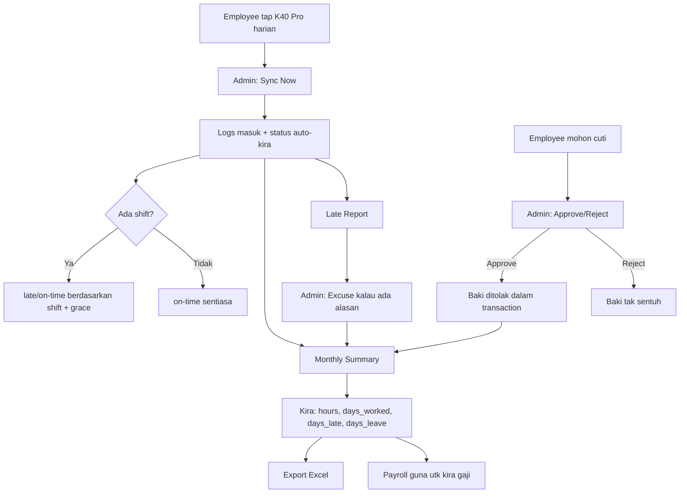

# EZOffice — Aliran Modul Attendance (Panduan Lengkap)

Dokumen ini merangkumi **aliran kerja penuh** modul Attendance selepas Phase C selesai:
Shift, Leave, Late Detection, Monthly Summary, dan integrasi peranti ZKTeco (K40 Pro / V1000).

> **Baca ini apabila:** anda perlu ingat cara guna modul Attendance, atau mahu terangkan
> kepada admin/pengguna baru. Untuk spesifikasi teknikal kod, rujuk `CLAUDE.md` (Decision Log,
> kemasukan 2026-07-05 — Phase C).

---

## 1. Gambaran Keseluruhan — 6 Tab

Modul Attendance dibahagikan kepada 6 tab di sidebar (`Attendance`):

| Tab | Tujuan | Pengguna |
|---|---|---|
| **Logs** | Quick Clock panel + senarai semua punch + edit/backfill | Admin |
| **Shifts** | CRUD definisi shift (Morning / Afternoon / Night) | Admin |
| **Leave** | Mohon cuti + lulus/tolak + baki tahunan | Admin (mewakili employee) |
| **Late Report** | Laporan siapa lambat, berapa kali, berapa minit | Admin |
| **Monthly Summary** | Kalendar bulanan + jam kerja + export Excel | Admin |
| **Device Settings** | IP/port peranti ZKTeco + Sync Now | Admin |

---

## 2. Setup Awal (sekali sahaja)

### 2.1 Daftar Employee + Assign Shift

```
Master Data → Employees → Add
  → Nama, department, contact, dll
  → Pilih Shift dropdown  ← WAJIB untuk late detection berfungsi
  → Save
```

> Jika employee tiada shift → status punch sentiasa `on-time` (tiada peraturan lambat).

### 2.2 Konfigurasi Shift

```
Attendance → Shifts tab
```

3 shift sudah **pre-seeded** sejak migration 0009:

| Shift | Mula | Tamat | Standard Hours |
|---|---|---|---|
| Morning | 08:00 | 17:00 | 9.0 |
| Afternoon | 13:00 | 22:00 | 9.0 |
| Night | 22:00 | 06:00 | 8.0 |

- Boleh **edit** (cth tukar waktu), **create** shift baru, atau **delete**.
- `standard_hours` digunakan untuk klasifikasi OT di Payroll (Phase 4).
- **Night shift melintasi tengah malam** (22:00→06:00) disokong — perbandingan masa
  dibuat pada hari kalendar punch tersebut.
- Jika shift dihapuskan, log attendance lama **tidak musnah** — `shift_id` snapshot
  menjadi `null` (FK `ON DELETE SET NULL`).

### 2.3 Set Baki Cuti Tahunan (Leave Entitlements)

```
Attendance → Leave tab → bahagian entitlement
```

Setiap employee perlu ada baki cuti setiap tahun:

| Jenis | Contoh | Had |
|---|---|---|
| `annual` | 14 hari/tahun | Berhad — baki ditolak on approve |
| `sick` | 10 hari/tahun | Berhad — baki ditolak on approve |
| `unpaid` | Tiada | **Tiada limit** — informational sahaja |

> Baki disimpan dalam `employee_leave_entitlements` (satu row per `employee × leave_type × year`).

### 2.4 Sambung Peranti ZKTeco (K40 Pro / V1000)

```
Attendance → Device Settings tab
  → Device IP:  cth 192.168.1.201  (IP peranti pada network)
  → Device Port: 4370              (default ZKTeco)
  → Save
  → Test Connection
```

**Konfigurasi pada peranti K40 Pro sendiri:**
1. Plug kabel LAN → `Menu → Comm Opt → TCP/IP`
2. Set IP, subnet, gateway; pastikan port = `4370`
3. Enroll fingerprint: `Menu → User Mgt → Enroll`
4. ⚠️ **User ID pada peranti MESTI sama dengan Employee ID di EZOffice**
   - Cth: User ID `1` pada K40 Pro → log masuk ke Employee ID `1` di EZOffice
   - Jika berbeza, sync akan skip dengan error: *"Device user_id X does not match any employee"*

---

## 3. Aliran Harian — Punch + Sync

### 3.1 Employee Tap Fingerprint

```
Pagi 07:55  → Employee tap K40 Pro  → IN
Petang 17:05 → Employee tap K40 Pro  → OUT
```

### 3.2 Admin Sync ke EZOffice

```
Attendance → Device Settings → "Sync Now"
```

Sistem akan:
1. Connect ke peranti via TCP (library `zkteco-js`)
2. Tarik semua attendance logs
3. Map: `user_id → employee_id`, `punch_state → in/out`, `punch_time → timestamp`
4. **Dedup** — skip jika `(employee_id, timestamp, type)` sudah wujud (idempotent)
5. **Validasi employee** — skip jika `user_id` tidak padan mana-mana employee
6. **Validasi alternation** — IN→OUT→IN→OUT (double-IN/OUT ditolak)
7. **Snapshot shift + status** — setiap log device juga dapat `shift_id` + `status` late detection
8. Insert dengan `source = 'device'`

Toast akan tunjuk: `Sync complete: X inserted, Y skipped`

### 3.3 Late Detection (Automatik)

Setiap clock-IN dinilai terhadap shift employee + grace period:

```
minutesLate = max(0, (punchTime - shiftStart) - gracePeriod)
status = minutesLate > 0 ? 'late' : 'on-time'
```

**Default grace period:** 15 minit (boleh diubah di `payroll_settings.grace_period_minutes`).

| Punch | Shift + Grace | Hasil |
|---|---|---|
| 07:55 | 08:00 + 15min | `on-time` ✓ |
| 08:15 | 08:00 + 15min | `on-time` ✓ (tepat pada grace) |
| 08:16 | 08:00 + 15min | `late` (1 minit) |
| 08:30 | 08:00 + 15min | `late` (15 minit) |

> **`absent` TIDAK di-set oleh clock-in** — ia di-derive di Monthly Summary untuk hari
> tanpa sebarang IN punch. **`excused-late` hanya di-set oleh admin** (override manual).

### 3.4 Fallback USB (jika network bermasalah)

Jika TCP sync gagal (firewall, network down):
1. Pada K40 Pro: `Menu → U Disk → Export Attendance Data` (format Excel)
2. Import manual melalui attendance import flow (sama pattern seperti CSV import employees)

---

## 4. Aliran Cuti (Leave)

### 4.1 Mohon Cuti

```
Attendance → Leave tab → "New Leave Request"
  → Pilih employee
  → Jenis: annual / sick / unpaid
  → Tarikh mula (date_from) + Tarikh tamat (date_to)
  → Sebab (optional)
  → Submit
```

**Validasi SEBELUM insert** (di `createLeaveRequest`):

| Semakan | Hasil jika gagal |
|---|---|
| `date_to >= date_from` | Reject: *"date_to must be on or after date_from"* |
| Tiada overlap dengan pending/approved lain | Reject: *"overlaps an existing pending/approved leave"* |
| Baki cukup (annual/sick) | Reject: *"exceeds available balance of X"* |
| Unpaid | **Skip semakan baki** (tiada limit) |

Status selepas mohon: **`pending`** — baki **BELUM ditolak**.

### 4.2 Lulus / Tolak

```
Attendance → Leave tab → bahagian "Pending"
  → Klik "Approve" atau "Reject"
```

| Tindakan | Kesan pada baki | Status |
|---|---|---|
| **Approve** | Tolak baki (annual/sick) dalam transaction | `approved` |
| **Reject** | **Tiada perubahan** baki | `rejected` |

> **Mengapa baki ditolak on approve, bukan on mohon?**
> Supaya menolak permohonan tidak sentuh baki, dan permohonan pending tidak "memesan" hari.
> Re-semak baki dilakukan sekali lagi pada approve (admin mungkin dah approve cuti lain
> di antara masa mohon dan masa approve).

### 4.3 Baki Tahunan

```
Attendance → Leave tab → pilih employee → tunjuk baki semasa
```

- Baki dikira per tahun (berdasarkan `date_from`).
- Baki `annual` dan `sick` berkurang setiap kali approve.
- Baki `unpaid` tidak ditunjuk (tiada had).

---

## 5. Aliran Late Report + Excuse

### 5.1 Laporan Lambat Bulanan

```
Attendance → Late Report tab → pilih bulan
```

Paparan: setiap employee dengan:
- Bilangan kali lambat
- Jumlah minit lambat

### 5.2 Excuse (Maafkan Keterlambatan)

Jika employee lambat tetapi ada alasan munasabah (hujan, jem, kecemasan):

```
Attendance → Logs tab
  → Cari row dengan status = "late" (badge oren)
  → Klik button "Excuse" (hanya muncul pada late IN punch)
  → Status bertukar: late → "excused-late" (badge biru)
```

**Kesan:**
- Tidak dikira sebagai `late` di Monthly Summary
- Tidak dikira di Late Report
- Rekod punch tetap kekal — cuma klasifikasi berubah

> `excused-late` hanya boleh di-set oleh admin, bukan automatik. Ini override manual.

---

## 6. Aliran Monthly Summary + Export

### 6.1 Paparan Kalendar Bulanan

```
Attendance → Monthly Summary tab → pilih employee + bulan
```

**Stat tiles (4 petak):**

| Petak | Kiraan |
|---|---|
| Total Hours | Jumlah jam kerja (IN-OUT pairs) |
| Days Worked | Hari ada pair IN/OUT lengkap |
| Days Late | Hari status = `late` (exclude `excused-late`) |
| Days Leave | Hari ada approved leave |

**Kalendar harian:**

| Tanggal | First IN | Last OUT | Hours | Status |
|---|---|---|---|---|
| 01-Jul | 07:55 | 17:05 | 9.17 | on-time |
| 02-Jul | 08:30 | 17:00 | 8.50 | late |
| 03-Jul | — | — | 0 | leave (annual) |
| 04-Jul | — | — | 0 | absent |
| 05-Jul | 08:45 | 17:10 | 8.42 | excused-late |

### 6.2 Cara Kira (di `getMonthlyAttendanceSummary`)

1. Fetch semua `attendance_logs` untuk employee dalam bulan tersebut, urut kronologi
2. Fetch tarikh approved leave dalam bulan tersebut
3. Group by tarikh:
   - **Hari ada approved leave** → mark `leave`, **skip jam** (payroll bayar 0 jam kerja)
   - **Hari ada IN + OUT** → pasangkan, kira `hours = lastOut - firstIn`
   - **Hari ada IN sahaja** (tiada OUT) → ignore (orphan, tidak dikira)
4. Klasifikasi OT: jika `hours > shift.standard_hours` → lebihan = OT
5. `days_worked` = hari ada pair lengkap
6. `days_late` = hari status = `late`
7. `days_leave` = hari ada approved leave

### 6.3 Export ke Excel

```
Klik "Export to Excel"
```

- Fail `.xlsx` dijana dengan `exceljs` dan **dibuka terus** (`shell.openPath`)
- Lokasi fail: `app.getPath('userData')/exports/`
- Sesuai untuk simpan rekod atau hantar kepada pihak berkenaan

---

## 7. Integrasi dengan Payroll (Phase 4)

Monthly Summary adalah **titik integrasi** antara Attendance dan Payroll:

| Data dari Attendance | Kegunaan di Payroll |
|---|---|
| `total_hours` | Gaji harian/jam |
| `ot_hours` | Kira OT rate (lebihan dari `standard_hours`) |
| `days_leave` (annual/sick) | Bayar gaji penuh, 0 jam kerja |
| `days_leave` (unpaid) | **Potong gaji** (tiada bayaran) |
| `days_late` | ⚠️ Potongan lambat — **Phase D, belum ada** |

> `getMonthlyAttendanceSummary` dipanggil oleh `payrollRun` semasa kira gaji bulanan.
> Data di-snapshot ke `payroll_run_items` supaya payslip tidak berubah walaupun log
> attendance diubah selepas itu.

---

## 8. Gambaran Keseluruhan (Diagram)



---

## 9. Had Semasa (belum diimplementasi)

| Feature | Status | Fasa akan datang |
|---|---|---|
| Potongan gaji lambat (late deduction) | ❌ Belum | Phase D |
| Click tarikh di kalendar → modal semua punch hari tu | ❌ Deferred | — |
| Auto-sync berkala (real-time, setiap N minit) | ❌ Manual sahaja | Refinement |
| Employee self-service (mohon cuti sendiri) | ❌ Admin mewakili | Phase B (roles) |
| Notifikasi cuti pending | ❌ Tiada | — |
| Enrollment fingerprint dari app | ❌ Buat di peranti terus | — |
| Audit logging pada mutation attendance | ❌ Service sedia, IPC belum wired | Phase B |

---

## 10. Troubleshooting

### Sync gagal

| Error | Sebab | Penyelesaian |
|---|---|---|
| *"Device unreachable at IP:4370"* | Salah IP / firewall / network berbeza | Semak IP, buka port 4370, pastikan sama network |
| *"Skipped: Device user_id X does not match any employee"* | User ID peranti ≠ Employee ID EZOffice | Re-enroll di peranti dengan ID yang betul |
| Sync berjaya tapi 0 inserted | Logs sudah wujud (dedup) | Normal — sync idempotent |

### Leave ditolak

| Error | Sebab |
|---|---|
| *"overlaps an existing pending/approved leave"* | Tarikh bertindih dengan cuti lain |
| *"exceeds available balance of X"* | Baki tidak cukup |
| *"No X leave entitlement exists"* | Belum set entitlement untuk tahun ini |

### Status punch salah

| Gejala | Sebab |
|---|---|
| Semua punch `on-time` walaupun lambat | Employee tiada shift → assign shift di Master Data |
| Punch device tiada `shift_name` | Shift dihapuskan selepas punch (snapshot jadi null) |
| `excused-late` tidak muncul di Late Report | Normal — excuse mengeluarkannya dari laporan |

---

## 11. Rujukan Kod

| Komponen | Fail |
|---|---|
| Service layer (shifts, leave, late, sync) | `electron/services/attendance.ts` |
| Monthly summary aggregation | `electron/services/attendanceSummary.ts` |
| IPC handlers | `electron/ipc/attendance.ts` |
| Schema (migration) | `electron/db/migrations/0009_leave_shifts_late.sql` |
| Renderer — hub page | `src/modules/attendance/AttendanceListPage.tsx` |
| Renderer — log form | `src/modules/attendance/AttendanceLogForm.tsx` |
| Renderer — device settings | `src/modules/attendance/DeviceSettingsPage.tsx` |
| Types (entities, inputs, api) | `src/shared/types/entities.ts`, `inputs.ts`, `api.ts` |
| Constants (status/leave tones) | `src/modules/attendance/constants.ts` |
| Decision log (Phase C) | `CLAUDE.md` §7, kemasukan 2026-07-05 |
